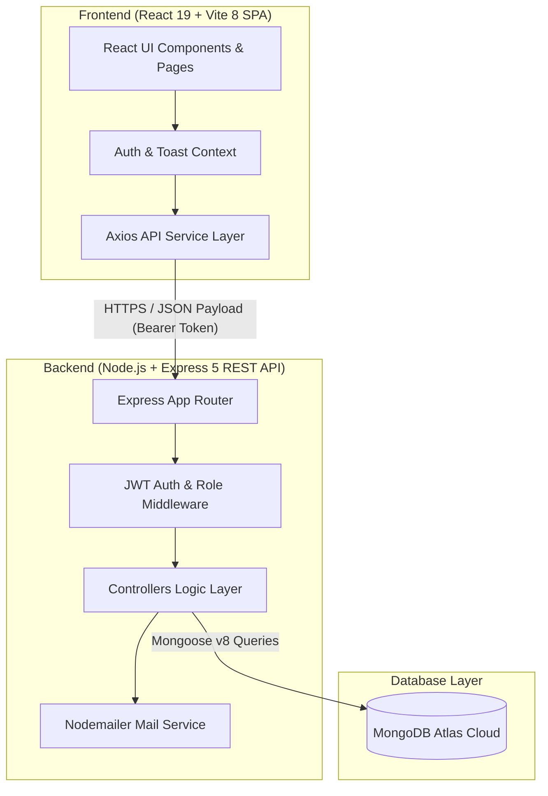
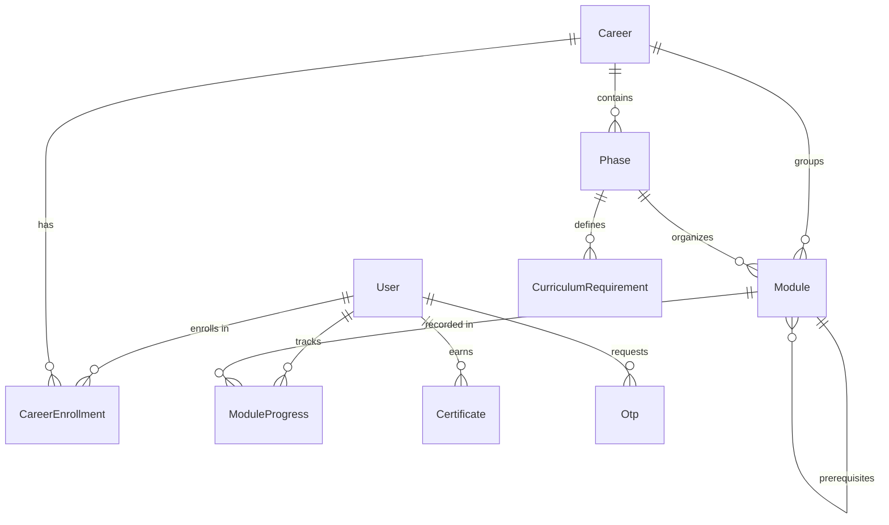

# PathPilot

> **Career Learning & Skill Development Ecosystem**

[](https://react.dev/)
[](https://vitejs.dev/)
[](https://tailwindcss.com/)
[](https://nodejs.org/)
[](https://expressjs.com/)
[](https://www.mongodb.com/)
[](LICENSE)

PathPilot is a full-stack MERN career learning and skill development platform designed to guide students through structured, industry-aligned career pathways. By organizing career goals into sequential phases, topic modules, embedded lessons, and granular progress tracking, PathPilot bridges the gap between skill acquisition and job readiness.

---

## Table of Contents

- [Project Overview](#project-overview)
- [Problem Statement](#problem-statement)
- [The PathPilot Solution](#the-pathpilot-solution)
- [Key Features](#key-features)
- [How PathPilot Works](#how-pathpilot-works)
- [System Architecture](#system-architecture)
- [Technology Stack](#technology-stack)
- [Core Technical Highlights](#core-technical-highlights)
- [Database Architecture](#database-architecture)
- [API Overview](#api-overview)
- [Frontend Route Overview](#frontend-route-overview)
- [Project Structure](#project-structure)
- [Production Deployment](#production-deployment)
- [Local Setup & Quickstart](#local-setup--quickstart)
- [Testing & Verification](#testing--verification)
- [Project Documentation](#project-documentation)
- [Future Scope](#future-scope)
- [Authors & Contributors](#authors--contributors)
- [License](#license)

---

## Project Overview

In today's tech ecosystem, learners often face **choice paralysis** due to fragmented tutorials and unstructured learning resources. **PathPilot V2** solves this problem by offering curated career tracks (such as Full Stack Developer, Data Analyst, AI Engineer, UI/UX Designer, Android Developer, and Cloud Engineer).

Learners enroll in dedicated tracks, navigate structured phase roadmaps, study lesson content with curated reference materials (PDFs, docs, code starters, and video tutorials), track granular lesson progress, and earn verifiable digital career certificates upon 100% completion.

---

## Problem Statement

Self-taught learners and early-career candidates face key challenges:
1. **Unstructured Curricula**: Jumping between random video series without clear prerequisite sequencing.
2. **Lack of Granular Progress Tracking**: Binary "completed/not completed" toggles that fail to measure actual lesson-level mastery.
3. **No Verifiable Credentials**: Absence of cryptographically unique, publicly verifiable proof of career track completion.
4. **Administrative Overhead**: Difficulty for administrators to manage career paths, restructure phases, author lessons, and track overall student progress.

---

## The PathPilot Solution

PathPilot addresses these challenges through an end-to-end architecture:
* **Curated Phase Roadmaps**: Breaks career tracks into ordered phases (e.g. Core Fundamentals → Advanced Engineering → Capstones).
* **Granular Lesson Engine**: Modules contain embedded subdocument lessons. Completing a lesson automatically updates module percentage and overall career progress.
* **Backend-Driven Unlock Engine**: Enforces module unlocking based on prerequisite completion rules.
* **Verifiable Certificate System**: Automatically issues a tamper-proof certificate with a unique tracking code (`PP-CERT-2026-XXXX`) upon reaching 100% curriculum completion, backed by a public verification portal.
* **Full-Featured Admin Management**: Comprehensive CRUD tools for administrators to manage users, careers, phases, modules, lessons, resources, and curriculum requirements.

---

## Key Features

### Student Experience
* **Public Career Catalog**: Explore active career tracks with details on required skills, duration, overview, and module counts.
* **Career Track Enrollment**: Enroll in target career tracks and manage active paths.
* **Phase-Based Career Roadmap**: Interactive visual roadmap showing phase milestones, required modules, and unlock requirements.
* **Rich Lesson Viewer**: Read detailed lesson content, key takeaways, and access attached study resources (PDFs, docs, web links, code starters, and video tutorials).
* **Granular Lesson Progress**: Click **"Mark Progress"** on individual lessons to record completion and trigger real-time percentage updates.
* **Dynamic Student Dashboard**: Unified hub displaying active career progress, total modules completed, and quick stats.
* **Verifiable Certificates**: View and claim career certificates upon 100% curriculum completion.
* **Profile Management**: View account profile details, security metadata, and contact info.

### Admin Experience (`/admin/*`)
* **Admin Analytics Dashboard**: System-wide statistics monitoring total users, active careers, total modules, progress records, and issued certificates.
* **User & Role Management**: Search registered users, filter by role/status, toggle user active status, update user roles, and safely delete accounts with dependency validation.
* **Career Management**: Create, update, toggle active status, and safely delete career tracks.
* **Phase Structure Management**: Create, sequence, update, and manage phase structures for each career path.
* **Module & Lesson Authoring**: Author learning modules, attach objectives, write detailed lesson content, specify duration, key takeaways, and embed resources.
* **Curriculum Requirement Rules**: Define required, optional, and choice-group rules per phase with minimum completion thresholds.
* **Dependency-Safe Operations**: Deletions strictly check student progress records and prerequisite dependencies before execution.

### Authentication & Security
* **JWT Authentication**: Secure registration and login issuing signed JSON Web Tokens (7-day validity).
* **Password Encryption**: Passwords salted and hashed with `bcrypt` (10 rounds).
* **OTP Password Reset**: 6-digit numeric OTP generation, bcrypt-hashed OTP storage, 10-minute TTL expiration, and email delivery via Nodemailer SMTP.
* **Role-Based Access Control**: Middleware enforcement for `student` and `admin` roles (`teacher` and `parent` are scaffold roles for future expansion).

### Progress & Curriculum Engine
* **Lesson-Level Completion**: Real-time progress recalculation (`POST /api/progress/lesson`).
* **Prerequisite Module Unlocking**: Modules unlock dynamically when all prerequisite modules are complete.
* **Phase Unlock Progression**: Phases unlock when prerequisite phases or requirement rules are satisfied.

### Certificate System
* **Automated Issuance**: Triggers when a student achieves 100% overall career progress.
* **Immutable Certificate ID**: Generates crypto-random identifiers (`PP-CERT-2026-XXXX`).
* **Public Verification Portal**: Publicly accessible verification endpoint (`/verify-certificate/:certificateId`) for employers and third parties.

---

## How PathPilot Works

```text
1. Registration / Login
   └── Student creates an account or logs in via JWT authentication.

2. Explore & Enroll
   └── Student selects a career track (e.g. Full Stack Developer) and enrolls.

3. Navigate Roadmap & Study Lessons
   └── Student opens an unlocked module, views lessons, and reviews study materials.

4. Click "Mark Progress"
   └── Sends POST /api/progress/lesson with lesson ID.
   └── Backend validates enrollment & subdocument lesson existence.
   └── Stores lesson completion in ModuleProgress.
   └── Recalculates module percentage (0–100%) and overall career progress.
   └── Evaluates prerequisite unlock rules for subsequent modules/phases.

5. Achieve 100% Completion & Earn Certificate
   └── Reaching 100% triggers certificate auto-issuance.
   └── System generates unique Certificate ID (PP-CERT-2026-XXXX).
   └── Public verification URL allows anyone to verify authenticity.
```

---

## System Architecture



### Deployment Topology
* **Frontend SPA**: Hosted on Vercel (`https://path-pilot-dun.vercel.app`)
* **Backend API**: Hosted on Render (`https://pathpilot-backend-3byw.onrender.com`)
* **Database**: MongoDB Atlas Cloud Cluster

---

## Technology Stack

### Frontend
* **Core Framework**: React `v19.2.7`
* **Build Tool**: Vite `v8.1.1`
* **Routing**: React Router DOM `v7.18.2`
* **Styling**: Tailwind CSS `v4.3.3` + `@tailwindcss/vite`
* **HTTP Client**: Axios `v1.18.1`

### Backend
* **Runtime Environment**: Node.js (`v18+` compatible)
* **Web Framework**: Express.js `v5.2.1`
* **Database ODM**: Mongoose `v8.18.2`
* **Authentication**: `jsonwebtoken` `v9.0.3`
* **Password Hashing**: `bcrypt` `v6.0.0`
* **Email Service**: Nodemailer `v9.0.5`
* **Environment Configuration**: `dotenv` `v17.4.2`
* **CORS Middleware**: `cors` `v2.8.6`

### Database
* **Database**: MongoDB Atlas Cloud

---

## Core Technical Highlights

1. **Granular Progress Recalculation**: Rather than simple binary flags, lesson completions dynamically re-calculate valid completed count against total module lessons, ensuring exact percentage accuracy (`0%` to `100%`).
2. **Subdocument Sub-schema**: Lessons are stored as embedded subdocuments inside `Module`, giving each lesson an explicit Mongoose `_id` while keeping lesson data co-located with the module for fast single-query retrieval.
3. **Account Enumeration Protection**: The password reset request endpoint returns a generic success response regardless of whether the email exists, preventing user discovery attacks.
4. **Idempotent Certificate Generation**: Duplicate key guards and database checks ensure no student receives duplicate certificates for the same career path.
5. **Dependency Guarded Deletions**: Admin module/career deletion requests verify active student progress records, curriculum requirements, and dependent module prerequisites before permitting deletion.

---

## Database Architecture



### Core Data Models
* **`User`**: System user schema (`name`, `email`, `password` hash, `role`, `phone`, `isActive`).
* **`Career`**: High-level learning path (`title`, `slug`, `description`, `overview`, `skills`, `estimatedDuration`).
* **`Phase`**: Stage in a career path (`career`, `title`, `description`, `order`, `prerequisitePhases`).
* **`Module`**: Topic unit (`career`, `phase`, `title`, `description`, `order`, `estimatedHours`, `objectives`, `lessons` subdocuments array, `prerequisites`).
* **`ModuleProgress`**: Progress document (`student`, `career`, `module`, `status`, `progressPercentage`, `completedLessons` array).
* **`CurriculumRequirement`**: Phase requirement rules (`phase`, `type`, `modules`, `minRequired`).
* **`Certificate`**: Earned credential (`certificateId`, `student`, `career`, `issuedAt`, `skillsMastered`, `completionTimeHours`).
* **`Otp`**: Password reset token (`email`, `otpHash`, `expiresAt`, `isUsed`).

---

## API Overview

### Authentication (`/api/auth`)
| Method | Endpoint | Auth | Role | Description |
| :--- | :--- | :---: | :---: | :--- |
| `POST` | `/api/auth/register` | No | Public | Register a new account |
| `POST` | `/api/auth/login` | No | Public | Login and obtain JWT token |
| `GET` | `/api/auth/me` | **Yes** | Any | Get profile of authenticated user |
| `POST` | `/api/auth/forgot-password` | No | Public | Send 6-digit OTP to user email |
| `POST` | `/api/auth/reset-password` | No | Public | Verify OTP and update password |

### Careers (`/api/careers`)
| Method | Endpoint | Auth | Role | Description |
| :--- | :--- | :---: | :---: | :--- |
| `GET` | `/api/careers` | No | Public | List all active career tracks |
| `GET` | `/api/careers/:slug` | No | Public | Get single career track by URL slug |

### Phases (`/api/phases`)
| Method | Endpoint | Auth | Role | Description |
| :--- | :--- | :---: | :---: | :--- |
| `GET` | `/api/phases/career/:careerId` | No | Public | Get active phases for a career track |
| `GET` | `/api/phases/:id` | No | Public | Get phase details by ID |

### Modules (`/api/modules`)
| Method | Endpoint | Auth | Role | Description |
| :--- | :--- | :---: | :---: | :--- |
| `GET` | `/api/modules/career/:careerId` | No | Public | Get active modules for a career track |
| `GET` | `/api/modules/phase/:phaseId` | No | Public | Get active modules in a phase |
| `GET` | `/api/modules/:id` | No | Public | Get module details including lessons & resources |

### Enrollments (`/api/enrollments`)
| Method | Endpoint | Auth | Role | Description |
| :--- | :--- | :---: | :---: | :--- |
| `POST` | `/api/enrollments/enroll` | **Yes** | Student | Enroll student in a career track |
| `GET` | `/api/enrollments/my-enrollments` | **Yes** | Student | Get all enrollments for logged-in student |
| `GET` | `/api/enrollments/active` | **Yes** | Student | Get student's current active career enrollment |

### Progress & Curriculum (`/api/progress`)
| Method | Endpoint | Auth | Role | Description |
| :--- | :--- | :---: | :---: | :--- |
| `GET` | `/api/progress/me` | **Yes** | Student | Get student module progress list |
| `PUT` | `/api/progress/module` | **Yes** | Student | Update progress status for a module |
| `POST` | `/api/progress/lesson` | **Yes** | Student | **Mark Progress**: Record completed lesson & recalculate progress |
| `GET` | `/api/progress/curriculum` | **Yes** | Student | Get aggregated phase & module curriculum unlock state |

### Dashboard (`/api/dashboard`)
| Method | Endpoint | Auth | Role | Description |
| :--- | :--- | :---: | :---: | :--- |
| `GET` | `/api/dashboard/overview` | **Yes** | Student | Get dashboard statistics, active track & overall progress |

### Certificates (`/api/certificates`)
| Method | Endpoint | Auth | Role | Description |
| :--- | :--- | :---: | :---: | :--- |
| `POST` | `/api/certificates/claim` | **Yes** | Student | Claim career certificate upon 100% completion |
| `GET` | `/api/certificates/my-certificates` | **Yes** | Student | Get all earned certificates for current student |
| `GET` | `/api/certificates/verify/:certificateId` | No | **Public** | **Verify Certificate**: Public verification endpoint |

### Admin Management (`/api/admin/*`)
| Method | Endpoint | Auth | Role | Description |
| :--- | :--- | :---: | :---: | :--- |
| `GET` | `/api/admin/dashboard` | **Yes** | Admin | Platform-wide metrics and stats |
| `GET`/`POST` | `/api/admin/careers` | **Yes** | Admin | List or Create career tracks |
| `PUT`/`PATCH`/`DELETE` | `/api/admin/careers/:id` | **Yes** | Admin | Update, Toggle status, or Delete career track |
| `GET`/`POST` | `/api/admin/phases` | **Yes** | Admin | List or Create phases |
| `PUT`/`PATCH`/`DELETE` | `/api/admin/phases/:id` | **Yes** | Admin | Update, Toggle status, or Delete phase |
| `GET`/`POST` | `/api/admin/modules` | **Yes** | Admin | List or Create modules with lessons |
| `GET`/`PUT`/`PATCH`/`DELETE` | `/api/admin/modules/:id` | **Yes** | Admin | Get, Update, Toggle status, or Delete module |
| `GET`/`POST` | `/api/admin/curriculum-requirements` | **Yes** | Admin | List or Create phase requirement rules |
| `PUT`/`DELETE` | `/api/admin/curriculum-requirements/:id` | **Yes** | Admin | Update or Delete requirement rule |
| `GET` | `/api/admin/users` | **Yes** | Admin | Search & list registered users |
| `PATCH` | `/api/admin/users/:id/status` | **Yes** | Admin | Toggle user active/deactivated status |
| `PATCH` | `/api/admin/users/:id/role` | **Yes** | Admin | Update user role (`student`, `admin`, `teacher`, `parent`) |
| `DELETE` | `/api/admin/users/:id` | **Yes** | Admin | Delete user account with dependency checks |

---

## Frontend Route Overview

### Public Routes
* `/` — Landing page with featured career tracks
* `/verify-certificate/:certificateId` — Public certificate verification view

### Auth Entry Routes (PublicOnlyRoute)
* `/login` — User login form
* `/register` — User registration form
* `/forgot-password` — Request password reset OTP
* `/reset-password` — Reset password using OTP

### Protected Student Routes (ProtectedRoute + AppLayout)
* `/student/dashboard` — Student overview dashboard
* `/my-career` & `/student/career` — Phase-based career roadmap & curriculum view
* `/learning-modules` & `/student/modules` — Module catalog view
* `/learning-modules/:moduleId` — Module details, lesson viewer & "Mark Progress" button
* `/progress` — Overall career stats & earned certificates
* `/profile` — Authenticated student profile page

### Protected Admin Routes (AdminRoute + AdminLayout)
* `/admin` & `/admin/dashboard` — Admin platform analytics dashboard
* `/admin/careers` — Career track CRUD management
* `/admin/phases` — Phase structure management
* `/admin/modules` — Module & lesson authoring panel
* `/admin/requirements` — Curriculum requirement rule management
* `/admin/users` — User account & role management

---

## Project Structure

```text
pathpilot/
├── client/                     # React 19 Frontend Application
│   ├── src/
│   │   ├── components/         # Reusable UI components (Navbar, AppLayout, ModuleCard, etc.)
│   │   ├── context/            # AuthContext & ToastContext providers
│   │   ├── layouts/            # AdminLayout wrapper
│   │   ├── pages/              # View pages (Student & Admin)
│   │   ├── routes/             # AppRoutes & protected route guards
│   │   ├── services/           # Axios API services
│   │   └── utils/              # Auth storage helpers
│   ├── package.json            # Client dependencies & scripts
│   └── vite.config.js          # Vite build plugin config
│
├── server/                     # Express 5 Node.js API Server
│   ├── config/                 # Database configuration (`db.js`)
│   ├── controllers/            # Controller logic (Auth, Progress, Admin, Certificate, etc.)
│   ├── middleware/             # Auth & Role verification middleware
│   ├── models/                 # Mongoose schema models (User, Career, Module, Phase, etc.)
│   ├── routes/                 # Express route definitions
│   ├── scripts/                # Database backfill & migration scripts
│   ├── seed/                   # Database seeder scripts (`careerSeed.js`)
│   ├── services/               # Mail service (`mailService.js`)
│   └── package.json            # Server dependencies & scripts
│
├── docs/                       # Comprehensive documentation files
└── README.md                   # Project README
```

---

## Production Deployment

* **Frontend Production URL**: [https://path-pilot-dun.vercel.app](https://path-pilot-dun.vercel.app)
* **Backend Production API**: [https://pathpilot-backend-3byw.onrender.com](https://pathpilot-backend-3byw.onrender.com)

---

## Local Setup & Quickstart

### Prerequisites
* **Node.js**: `v18.x` or higher
* **npm**: `v9.x` or higher
* **MongoDB**: A local MongoDB instance or MongoDB Atlas URI

### Step-by-Step Installation

1. **Clone the Repository**:
   ```bash
   git clone https://github.com/mhksharma140807/PathPilot.git
   cd pathpilot
   ```

2. **Configure Server Environment**:
   Create a `.env` file in the `server/` directory:
   ```env
   PORT=5000
   MONGODB_URI=mongodb://localhost:27017/pathpilot
   JWT_SECRET=your_super_secret_jwt_key
   FRONTEND_URL=http://localhost:5173
   EMAIL_HOST=smtp.gmail.com
   EMAIL_PORT=587
   EMAIL_USER=your_email@gmail.com
   EMAIL_PASS=your_app_password
   EMAIL_FROM="PathPilot Support" <your_email@gmail.com>
   ```

3. **Install Dependencies**:
   ```bash
   # Install server dependencies
   cd server
   npm install

   # Install client dependencies
   cd ../client
   npm install
   ```

4. **Seed Database & Backfill Lessons**:
   ```bash
   cd ../server
   # Seed career tracks, phases, modules & standard lessons
   npm run seed:careers

   # Run backfill script (ensures all modules have embedded lessons)
   node scripts/backfillModuleLessons.js
   ```

5. **Run Development Servers**:
   ```bash
   # Start backend API server (Port 5000)
   cd server
   npm run dev

   # In a new terminal, start frontend client (Port 5173)
   cd client
   npm run dev
   ```

---

## Testing & Verification

### Client Build Verification
```bash
npm run build --prefix client
```

### Backend Syntax Verification
```bash
node -c server/server.js
node -c server/app.js
node -c server/controllers/progressController.js
```

---

## Project Documentation

Detailed architectural and API documentation files are available under `docs/`:

* [`docs/PROJECT_OVERVIEW.md`](docs/PROJECT_OVERVIEW.md) — Product vision, goals & scope
* [`docs/ARCHITECTURE.md`](docs/ARCHITECTURE.md) — Architectural patterns, sequence diagrams & topologies
* [`docs/DATABASE_SCHEMA.md`](docs/DATABASE_SCHEMA.md) — Detailed Mongoose models & ER diagrams
* [`docs/API_DOCUMENTATION.md`](docs/API_DOCUMENTATION.md) — Complete REST API specifications
* [`docs/SETUP_GUIDE.md`](docs/SETUP_GUIDE.md) — Installation, environment variables & troubleshooting
* [`docs/CHANGELOG.md`](docs/CHANGELOG.md) — Version release notes (V1 → V2)
* [`docs/UI_GUIDELINES.md`](docs/UI_GUIDELINES.md) — Design tokens & Tailwind CSS v4 styling rules
* [`docs/FUTURE_SCOPE.md`](docs/FUTURE_SCOPE.md) — Post-V2 enhancement roadmap

---

## Future Scope

- **AI-Powered Recommendations**: Machine learning recommendation engines for personalized career path selection.
- **Interactive Quizzes & Knowledge Assessments**: End-of-module interactive quizzes to evaluate comprehension prior to completion.
- **Dedicated Teacher & Parent Portals**: Full portal implementations for the scaffolded `teacher` and `parent` roles.
- **Peer Code Review & Community Forums**: Social learning channels for student collaboration.

---

## Authors & Contributors

**Mahak Sharma**
- **Role**: Full Stack Developer & Architect
- **Repository**: [PathPilot GitHub](https://github.com/mhksharma140807/PathPilot)

**Bhumi**
- **Role**: Frontend Developer

---
- **Team**: PathPilot
