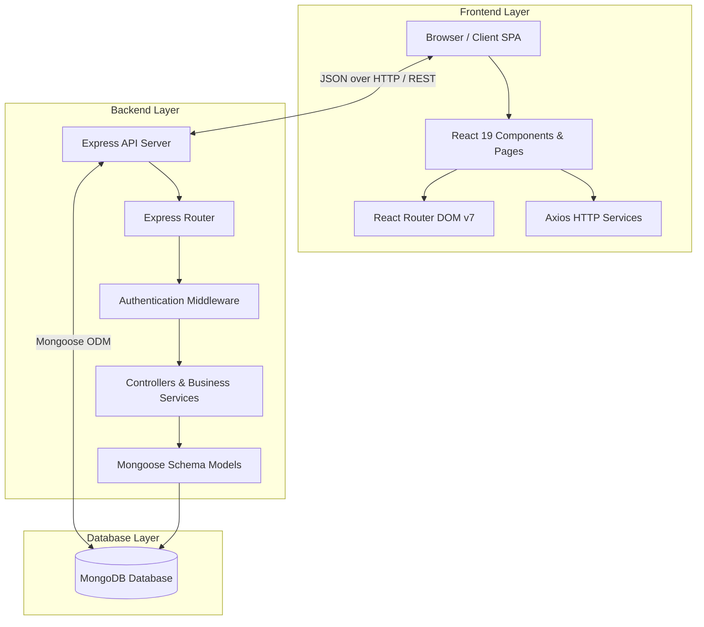
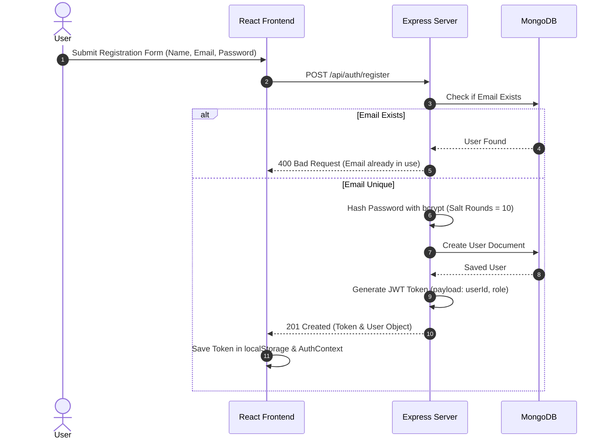
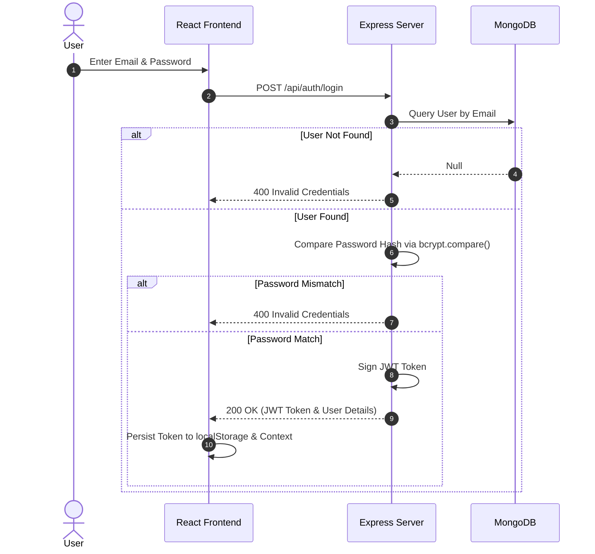
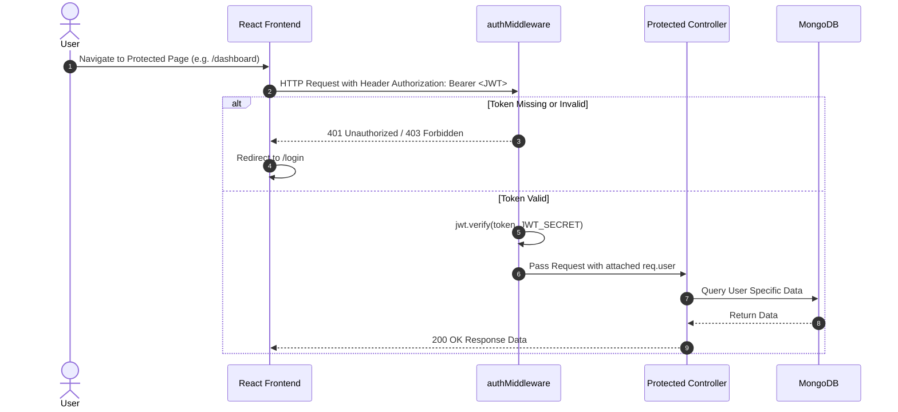

# PathPilot Architecture

> Technical Systems & Architecture Documentation for PathPilot Version 1

---

## 1. Project Overview

**PathPilot** is a full-stack career learning and skill development ecosystem engineered to provide structured learning roadmaps, interactive module tracking, and centralized student dashboards. The platform separates client-side presentation from server-side business logic and data persistence, providing a resilient and extensible architecture.

---

## 2. High Level Architecture

PathPilot follows a modern, layered Client-Server Architecture. The frontend Single-Page Application (SPA) communicates asynchronously with a RESTful Express API layer over HTTP/HTTPS, which interacts with a persistent MongoDB database layer via Mongoose ODM.



---

## 3. Frontend Layer

The client application is built with React 19 using Vite as its build tool and bundler.

### React
- Declarative component-based user interface framework.
- Uses functional components with React Hooks (`useState`, `useEffect`, `useContext`) for clean state management.

### React Router
- Utilizes `react-router-dom` (v7) for client-side routing.
- Configures dynamic routing for public pages (`/login`, `/register`, `/careers`) and protected user pages (`/dashboard`, `/profile`, `/modules/:careerId`).

### Components
- Reusable UI elements designed to maintain visual consistency across pages.
- Core components include:
  - `Navbar`: Header navigation bar handling user authentication state and logout.
  - `Footer`: Application footer.
  - `ModuleCard`: Card component displaying module title, duration, difficulty, and completion checkbox.
  - `ProgressBar`: Dynamic visual progress indicator.

### Pages
- Full views representing top-level application routes:
  - `Home.jsx`: Public landing page.
  - `Login.jsx` & `Register.jsx`: Authentication views.
  - `Careers.jsx` & `CareerDetails.jsx`: Career track discovery and details.
  - `LearningModules.jsx`: Interactive learning module progress viewer.
  - `Dashboard.jsx`: Central student analytics and active enrollment overview.
  - `Profile.jsx`: User profile settings and info.

### Services
- Axios-based API client wrappers (`client/src/services/api.js`).
- Encapsulates base API URL configuration, request headers, and automatic JWT token attachment (`Bearer <token>`).

---

## 4. Backend Layer

The backend is built on Node.js and Express (v5), designed using a modular Controller-Service-Route architecture.

### Express
- High-performance web framework serving as the HTTP REST API engine.
- Configured with CORS, JSON body parser (`express.json()`), and route delegation.

### Controllers
- Handles HTTP requests, extracts parameters, coordinates business service invocation, and returns formatted JSON responses.
- Examples: `authController.js`, `careerController.js`, `moduleController.js`, `enrollmentController.js`, `progressController.js`, `dashboardController.js`.

### Routes
- Express routing modules that map URI paths and HTTP verbs (`GET`, `POST`, `PUT`, `DELETE`) to corresponding controller actions and middleware functions.

### Middleware
- Intercepts requests for authentication and authorization.
- `authMiddleware.js`: Decodes JWT tokens passed in the `Authorization` header, verifies validity, extracts the payload, and attaches `req.user`.

### Models
- Mongoose schemas defining database document structures, data types, validation rules, default values, and index definitions.

---

## 5. Database Layer

### MongoDB
- Document-oriented NoSQL database providing flexible JSON-like document storage.
- Interfaced through **Mongoose ODM v8** to enforce schema structures, relationship references (`ObjectId`), and timestamp tracking (`createdAt`, `updatedAt`).

---

## 6. Authentication Flow

PathPilot implements token-based authentication using **JSON Web Tokens (JWT)** and **bcrypt** password hashing.

### Registration Flow



### User Login Flow



### Protected Route Flow



---

## 7. Data Flow

The complete data lifecycle follows a unidirectional flow through the system layers:

```text
[ Browser / User Action ]
          │
          ▼
[ React Component State ]
          │
          ▼
[ Axios Service Request ]  ──( HTTP JSON Request )──►  [ Express Router ]
                                                               │
                                                               ▼
                                                      [ Auth Middleware ]
                                                               │
                                                               ▼
                                                      [ Controller Logic ]
                                                               │
                                                               ▼
[ Browser UI Render ]  ◄──( HTTP JSON Response )──────  [ Mongoose / MongoDB ]
```

1. **User Action**: The user interacts with a component in the Browser (e.g., clicking "Complete Module").
2. **React State & Service Call**: React triggers an event handler that invokes an Axios API call containing the request body and JWT header.
3. **Express Processing**: The HTTP request hits the Express Router, passes through `authMiddleware` for validation, and enters the corresponding Controller.
4. **Database Query**: The Controller executes Mongoose operations (`find`, `create`, `findOneAndUpdate`) against MongoDB.
5. **JSON Response & UI Update**: MongoDB returns results to the Controller, which formats a JSON response sent back to the React app to update component state and render updated UI elements.

---

## 8. Folder Structure Explanation

```text
pathpilot/
├── client/                     # Frontend Application Root
│   ├── public/                 # Static assets (favicons, public images)
│   ├── src/
│   │   ├── components/         # Modular reusable components (Navbar, Footer, ModuleCard)
│   │   ├── context/            # Global React Context providers (AuthContext)
│   │   ├── pages/              # Page-level components corresponding to router routes
│   │   ├── routes/             # App routing table and ProtectedRoute guards
│   │   ├── services/           # Axios API instances and centralized request handlers
│   │   ├── app.css             # Main style definitions and Tailwind imports
│   │   ├── main.jsx            # React root DOM mounting script
│   │   └── App.jsx             # Top-level application layout wrapper
│   ├── index.html              # HTML host document
│   └── vite.config.js          # Vite build and plugin configurations
│
└── server/                     # Backend API Root
    ├── config/                 # Database configuration (db.js)
    ├── controllers/            # Request handlers separating HTTP logic from DB operations
    ├── middleware/             # Express middlewares (JWT verification, role validation)
    ├── models/                 # Mongoose schemas (User, Career, Module, CareerEnrollment, ModuleProgress)
    ├── routes/                 # API endpoint routing declarations
    ├── seed/                   # Database seeder scripts for initial career tracks
    ├── services/               # Specialized business logic handlers
    ├── utils/                  # Shared helper functions and constants
    ├── app.js                  # Express app middleware and route definitions
    └── server.js               # Server entry point initializing DB connection & HTTP listener
```

---

## 9. Why This Architecture Was Selected

- **Separation of Concerns**: Decoupling the React client from the Node.js API allows independent frontend and backend development, testing, and deployment.
- **Stateless Authentication**: JWT-based authentication eliminates the need for server-side session state, simplifying horizontal scaling.
- **Schema Flexibility**: MongoDB's document model accommodates multi-faceted career data structures with nested lessons and objectives without complex SQL joins.
- **Developer Velocity**: JavaScript/Node.js across the full stack enables seamless code sharing (JSON data formats) and fast prototyping.

---

## 10. Scalability

PathPilot is designed to scale across multiple dimensions:

- **Horizontal API Scaling**: The stateless Express API can be replicated across multiple containers behind a load balancer (e.g., NGINX or AWS ALB).
- **Database Indexing**: MongoDB collections feature compound indexes (e.g., `{ student: 1, module: 1 }` on `ModuleProgress`) to guarantee $O(\log N)$ query performance under high load.
- **Frontend CDN Caching**: The production SPA build consists of static HTML/JS/CSS bundles that can be globally cached on Content Delivery Networks (CDNs) like Cloudflare or AWS CloudFront.

---

## 11. Future Expansion

The architecture is prepared for seamless integration of extended role modules and services in future iterations:

### Admin Module
- Dedicated management portal for adding, editing, or archiving career tracks and modules.
- User management and platform analytic reports.

### Teacher Module
- Instructor portal to assign customized career paths to specific student groups.
- Grade assignment and manual module verification.

### Parent Module
- Read-only dashboard for parents to monitor student learning activity, module completion rates, and study consistency.

### Notification Service
- Microservice architecture integration for dispatching email and push notifications regarding module deadlines, streaks, and platform updates.
