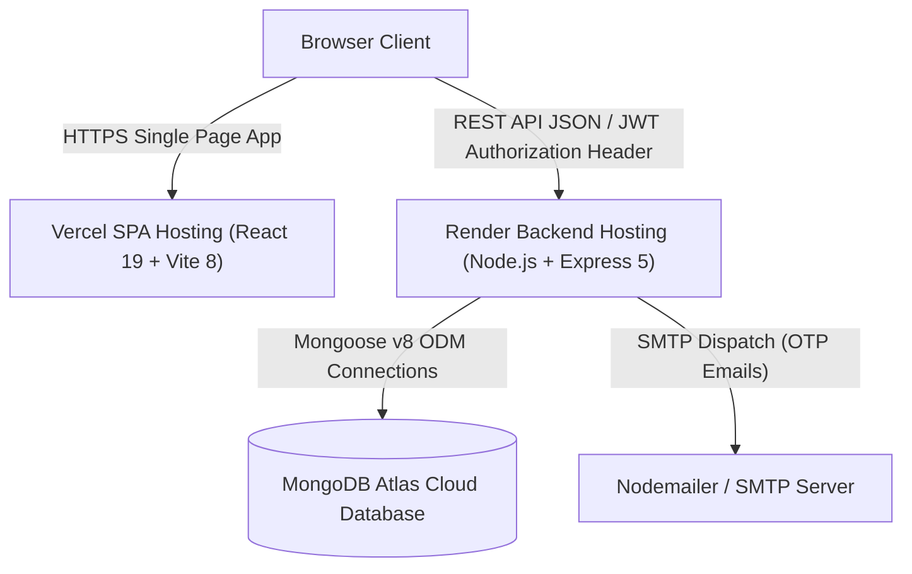
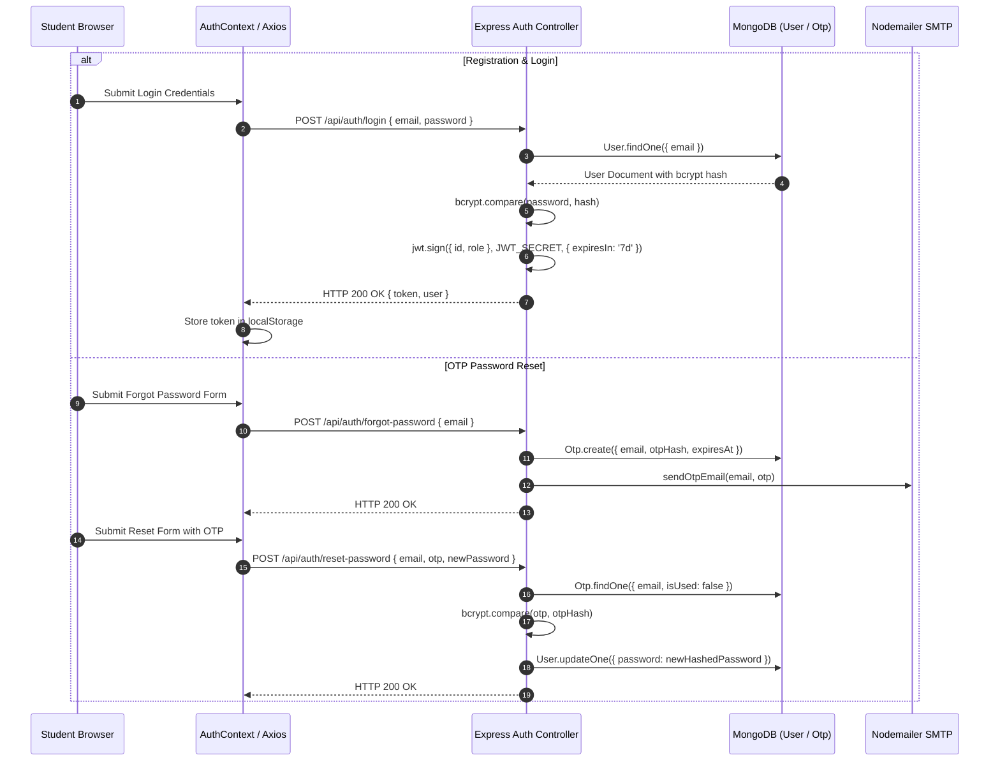
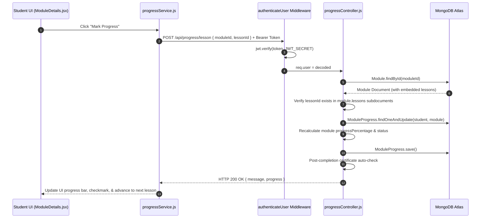
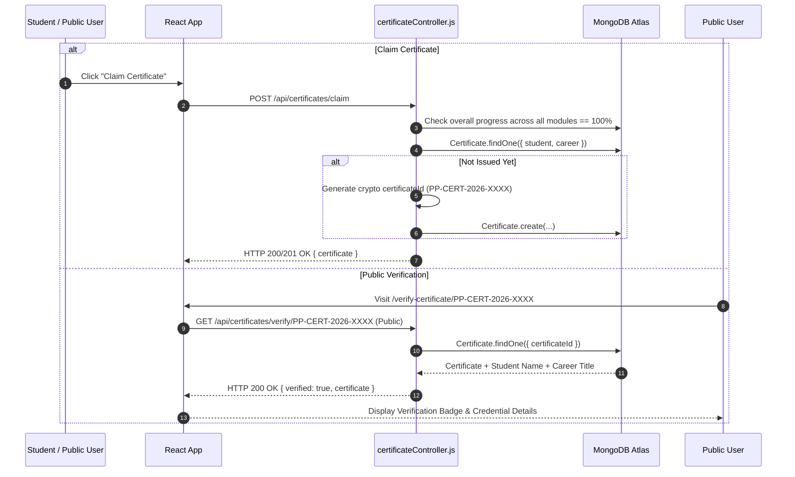

# PathPilot V2 System Architecture

## 1. High-Level Architecture Topology

PathPilot V2 follows a decoupled Client-Server architecture:
* **Frontend**: Single Page Application (SPA) built with React 19, Vite 8, and Tailwind CSS v4, hosted on Vercel.
* **Backend**: Stateless RESTful API built with Express.js 5 and Node.js, hosted on Render.
* **Database**: Managed cloud document store using MongoDB Atlas accessed via Mongoose ODM v8.

---

## 2. Authentication Flow

---

## 3. Lesson Progress & Curriculum Unlock Flow

---

## 4. Certificate Generation & Verification Flow

---

## 5. Admin Management Architecture

```mermaid
flowchart LR
    AdminUI[Admin Panel UI /admin/*]
    AdminGuard[AdminRoute Guard]
    AdminService[adminService.js]
    AuthMW[authenticateUser Middleware]
    RoleMW[authorizeRoles 'admin']
    AdminControllers[Admin Controllers]
    MongoDB[(MongoDB Atlas)]

    AdminUI --> AdminGuard
    AdminGuard --> AdminService
    AdminService -- "Axios /api/admin/*" --> AuthMW
    AuthMW --> RoleMW
    RoleMW --> AdminControllers
    AdminControllers -- "CRUD & Dependency Checks" --> MongoDB
```

---

## 6. Architectural Design Decisions

1. **Embedded Subdocuments for Lessons**: Lessons are embedded subdocuments inside `Module` schemas rather than separate collections. This guarantees single-query loading performance when fetching a module and co-locates content with the module entity.
2. **Relational References for Progress & Enrollments**: `ModuleProgress`, `CareerEnrollment`, and `Certificate` exist as separate top-level collections referencing `User` and `Module`/`Career` IDs. This prevents document size unbounded growth in `User` documents and ensures clean indexing.
3. **Stateless JWT Authorization**: API servers do not maintain session state in memory. All user role and identity claims are encoded inside signed JWT tokens, facilitating horizontal server scaling.
