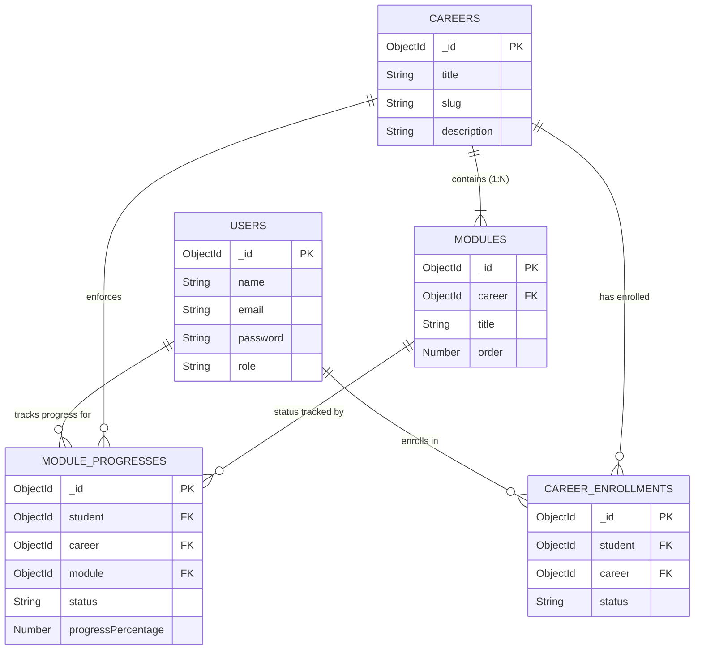

# PathPilot Database Schema Documentation

> Comprehensive Database Schema & Data Dictionary for PathPilot Version 1

---

## 1. Database Overview

- **Database Name**: `pathpilot`
- **Database Engine**: MongoDB (v6.0+)
- **Object Data Mapper (ODM)**: Mongoose (v8.x)

---

## 2. Collections Overview

PathPilot utilizes five core collections to manage user authentication, career pathways, learning content, enrollments, and granular completion tracking:

1. `users`
2. `careers`
3. `modules`
4. `careerenrollments`
5. `moduleprogresses`

---

## 3. Detailed Data Dictionary

### Collection: `users`

Stores registered account information, credentials, roles, and profile settings for platform users.

#### Schema Definition

```javascript
{
  name: { type: String, required: true, trim: true },
  email: { type: String, required: true, unique: true, lowercase: true, trim: true },
  password: { type: String, required: true, minlength: 6 },
  role: { type: String, enum: ["student", "teacher", "parent", "admin"], default: "student" },
  phone: { type: String, default: "" },
  profileImage: { type: String, default: "" },
  isVerified: { type: Boolean, default: false },
  isActive: { type: Boolean, default: true },
  createdAt: { type: Date, default: Date.now },
  updatedAt: { type: Date, default: Date.now }
}
```

#### Field Explanations

| Field | Data Type | Constraints | Description |
| :--- | :--- | :--- | :--- |
| `_id` | `ObjectId` | Auto Primary Key | Unique document identifier generated by MongoDB. |
| `name` | `String` | Required, Trimmed | Full name of the user. |
| `email` | `String` | Required, Unique, Lowercase | Unique email address used for login and notifications. |
| `password` | `String` | Required, Min length 6 | Password string encrypted using `bcrypt` hashing algorithms. |
| `role` | `String` | Enum (`student`, `teacher`, `parent`, `admin`) | User authorization role determining access permissions. Default is `student`. |
| `phone` | `String` | Optional | Contact phone number for user profile. |
| `profileImage` | `String` | Optional URL/Path | URL path to the user's avatar image. |
| `isVerified` | `Boolean` | Default: `false` | Status indicating if the user's email has been verified. |
| `isActive` | `Boolean` | Default: `true` | Status flag for administrative account enabling/disabling. |
| `createdAt` | `Date` | Timestamp | Timestamp when user document was created. |
| `updatedAt` | `Date` | Timestamp | Timestamp when user document was last modified. |

---

### Collection: `careers`

Contains structured career path track information, overview summaries, and required skills.

#### Schema Definition

```javascript
{
  title: { type: String, required: true, trim: true },
  slug: { type: String, required: true, unique: true, lowercase: true, trim: true },
  description: { type: String, required: true, trim: true },
  overview: { type: String, default: "", trim: true },
  skills: [{ type: String, trim: true }],
  estimatedDuration: { type: String, default: "", trim: true },
  isActive: { type: Boolean, default: true },
  createdAt: { type: Date, default: Date.now },
  updatedAt: { type: Date, default: Date.now }
}
```

#### Field Explanations

| Field | Data Type | Constraints | Description |
| :--- | :--- | :--- | :--- |
| `_id` | `ObjectId` | Auto Primary Key | Unique career track identifier. |
| `title` | `String` | Required, Trimmed | Title of the career track (e.g., "Frontend Developer"). |
| `slug` | `String` | Required, Unique, Lowercase | URL-friendly slug identifier (e.g., "frontend-developer"). |
| `description` | `String` | Required | High-level summary of the career track. |
| `overview` | `String` | Optional | Detailed overview of target industries, career prospects, and expectations. |
| `skills` | `Array<String>` | List of Strings | Array of key skills acquired in this career path (e.g., ["React", "CSS", "TypeScript"]). |
| `estimatedDuration` | `String` | Optional | Estimated total completion time (e.g., "8 Weeks"). |
| `isActive` | `Boolean` | Default: `true` | Flag indicating whether career path is actively visible to students. |
| `createdAt` | `Date` | Timestamp | Creation timestamp. |
| `updatedAt` | `Date` | Timestamp | Modification timestamp. |

---

### Collection: `modules`

Stores step-by-step topic modules associated with a specific career track, including nested lessons and objectives.

#### Schema Definition

```javascript
{
  career: { type: mongoose.Schema.Types.ObjectId, ref: "Career", required: true },
  title: { type: String, required: true, trim: true },
  description: { type: String, required: true, trim: true },
  order: { type: Number, required: true, min: 1 },
  estimatedHours: { type: Number, default: 0, min: 0 },
  objectives: [{ type: String, trim: true }],
  lessons: [{
    title: { type: String, required: true },
    duration: { type: String, default: "15 mins" },
    content: { type: String, required: true },
    keyTakeaway: { type: String, default: "" }
  }],
  isActive: { type: Boolean, default: true },
  createdAt: { type: Date, default: Date.now },
  updatedAt: { type: Date, default: Date.now }
}
```

#### Field Explanations

| Field | Data Type | Constraints | Description |
| :--- | :--- | :--- | :--- |
| `_id` | `ObjectId` | Auto Primary Key | Unique learning module identifier. |
| `career` | `ObjectId` | Foreign Key (Ref: `Career`) | Reference ID of the parent career track. |
| `title` | `String` | Required | Module title (e.g., "HTML5 & Semantic Web"). |
| `description` | `String` | Required | Summary of topics covered within this module. |
| `order` | `Number` | Required, Min: 1 | Sequential ordering index of module within its career track. |
| `estimatedHours` | `Number` | Default: `0` | Estimated learning duration in hours. |
| `objectives` | `Array<String>` | List of Strings | Learning goals and key outcomes for the module. |
| `lessons` | `Array<Object>` | Sub-document Array | Array of lesson objects detailing topic sub-sections, text content, and takeaways. |
| `isActive` | `Boolean` | Default: `true` | Availability status flag. |
| `createdAt` | `Date` | Timestamp | Creation timestamp. |
| `updatedAt` | `Date` | Timestamp | Modification timestamp. |

---

### Collection: `careerenrollments`

Tracks student enrollments into specific career paths.

#### Schema Definition

```javascript
{
  student: { type: mongoose.Schema.Types.ObjectId, ref: "User", required: true, unique: true },
  career: { type: mongoose.Schema.Types.ObjectId, ref: "Career", required: true },
  status: { type: String, enum: ["active", "completed"], default: "active" },
  enrolledAt: { type: Date, default: Date.now },
  completedAt: { type: Date, default: null },
  createdAt: { type: Date, default: Date.now },
  updatedAt: { type: Date, default: Date.now }
}
```

#### Field Explanations

| Field | Data Type | Constraints | Description |
| :--- | :--- | :--- | :--- |
| `_id` | `ObjectId` | Auto Primary Key | Unique enrollment record identifier. |
| `student` | `ObjectId` | Foreign Key (Ref: `User`) | Reference ID of the enrolled student user. |
| `career` | `ObjectId` | Foreign Key (Ref: `Career`) | Reference ID of the enrolled career track. |
| `status` | `String` | Enum (`active`, `completed`) | Current status of the career track enrollment. |
| `enrolledAt` | `Date` | Default: `Date.now` | Timestamp when enrollment occurred. |
| `completedAt` | `Date` | Default: `null` | Timestamp when 100% completion occurred (if complete). |
| `createdAt` | `Date` | Timestamp | Creation timestamp. |
| `updatedAt` | `Date` | Timestamp | Modification timestamp. |

---

### Collection: `moduleprogresses`

Tracks stateful completion of individual modules per student.

#### Schema Definition

```javascript
{
  student: { type: mongoose.Schema.Types.ObjectId, ref: "User", required: true },
  career: { type: mongoose.Schema.Types.ObjectId, ref: "Career", required: true },
  module: { type: mongoose.Schema.Types.ObjectId, ref: "Module", required: true },
  status: { type: String, enum: ["not_started", "in_progress", "completed"], default: "not_started" },
  progressPercentage: { type: Number, default: 0, min: 0, max: 100 },
  completedAt: { type: Date, default: null },
  createdAt: { type: Date, default: Date.now },
  updatedAt: { type: Date, default: Date.now }
}
```

#### Field Explanations

| Field | Data Type | Constraints | Description |
| :--- | :--- | :--- | :--- |
| `_id` | `ObjectId` | Auto Primary Key | Unique progress record identifier. |
| `student` | `ObjectId` | Foreign Key (Ref: `User`) | Reference ID of the student tracking progress. |
| `career` | `ObjectId` | Foreign Key (Ref: `Career`) | Reference ID of the associated career track. |
| `module` | `ObjectId` | Foreign Key (Ref: `Module`) | Reference ID of the module being tracked. |
| `status` | `String` | Enum (`not_started`, `in_progress`, `completed`) | Current completion state of the module. |
| `progressPercentage` | `Number` | Min: 0, Max: 100 | Percentage score of completion (0% for not started, 100% for completed). |
| `completedAt` | `Date` | Default: `null` | Timestamp when module status changed to `completed`. |
| `createdAt` | `Date` | Timestamp | Creation timestamp. |
| `updatedAt` | `Date` | Timestamp | Modification timestamp. |

---

## 4. Entity Relationships & ER Diagram



### Explanation of Relationships (One-to-Many & Referencing)

- **User to CareerEnrollment (1:N)**: A single student (`User`) can enroll in career paths, creating documents in `CareerEnrollment` referencing `User._id`.
- **Career to Module (1:N)**: A single `Career` path contains multiple ordered `Module` documents. Each module references its parent career via `career: ObjectId`.
- **Module to ModuleProgress (1:N)**: A single `Module` has progress documents tracking individual completion states across different students via `module: ObjectId`.
- **User to ModuleProgress (1:N)**: A student (`User`) has multiple `ModuleProgress` entries mapping their completion status for every module in their enrolled paths.

---

## 5. Planned Future Collections

As PathPilot evolves into Version 2, the following database collections are scheduled to be added:

### `certificates`
Stores generated completion certificates for students who finish 100% of a career path.
- **Fields**: `student` (Ref: User), `career` (Ref: Career), `certificateCode`, `issuedAt`, `pdfUrl`.

### `achievements`
Defines badges and unlockable rewards earned by students.
- **Fields**: `title`, `description`, `badgeIcon`, `criteriaType`, `requiredCount`.

### `notifications`
Stores system and reminder notifications sent to users.
- **Fields**: `recipient` (Ref: User), `title`, `message`, `type` (`reminder`, `achievement`, `announcement`), `isRead`, `createdAt`.

### `leaderboards`
Tracks global or cohort student rankings based on completion velocity and XP points.
- **Fields**: `student` (Ref: User), `xpPoints`, `rank`, `modulesCompleted`, `updatedAt`.

### `feedbacks`
Collects student module reviews and content rating feedback.
- **Fields**: `student` (Ref: User), `module` (Ref: Module), `rating` (1-5), `comments`, `createdAt`.
