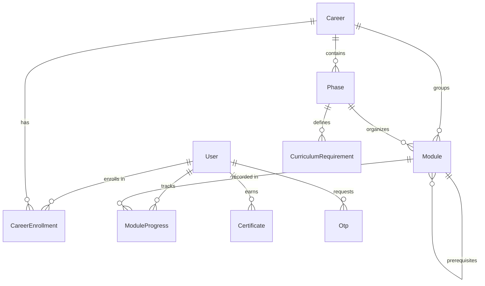

# PathPilot V2 Database Schema Specification

## Entity Relationship Diagram



---

## 1. `User` Schema (`users` collection)

Stores user identity and authorization role metadata.

```javascript
{
  name: { type: String, required: true, trim: true },
  email: { type: String, required: true, unique: true, lowercase: true, trim: true },
  password: { type: String, required: true, minlength: 6 },
  role: { type: String, enum: ["student", "teacher", "parent", "admin"], default: "student" },
  phone: { type: String, default: "" },
  profileImage: { type: String, default: "" },
  isVerified: { type: Boolean, default: false },
  isActive: { type: Boolean, default: true },
  timestamps: true
}
```

---

## 2. `Career` Schema (`careers` collection)

High-level career pathway entity.

```javascript
{
  title: { type: String, required: true, trim: true },
  slug: { type: String, required: true, unique: true, lowercase: true, trim: true },
  description: { type: String, required: true, trim: true },
  overview: { type: String, default: "" },
  skills: [{ type: String, trim: true }],
  estimatedDuration: { type: String, default: "" },
  isActive: { type: Boolean, default: true },
  timestamps: true
}
```

---

## 3. `Phase` Schema (`phases` collection)

Organizes modules into sequential structural stages within a career track.

```javascript
{
  career: { type: ObjectId, ref: "Career", required: true },
  title: { type: String, required: true, trim: true },
  description: { type: String, default: "" },
  order: { type: Number, required: true, min: 1 },
  prerequisitePhases: [{ type: ObjectId, ref: "Phase" }],
  isActive: { type: Boolean, default: true },
  timestamps: true
}
// Index: { career: 1, order: 1 } (Unique)
```

---

## 4. `Module` Schema (`modules` collection)

Primary learning unit. Contains embedded subdocument arrays for `lessons`.

```javascript
{
  career: { type: ObjectId, ref: "Career", required: true },
  phase: { type: ObjectId, ref: "Phase", default: null },
  title: { type: String, required: true, trim: true },
  description: { type: String, required: true, trim: true },
  order: { type: Number, required: true, min: 1 },
  estimatedHours: { type: Number, default: 0, min: 0 },
  objectives: [{ type: String, trim: true }],
  lessons: [
    {
      _id: { type: ObjectId, default: () => new mongoose.Types.ObjectId() },
      title: { type: String, required: true, trim: true },
      duration: { type: String, default: "15 mins" },
      content: { type: String, required: true },
      keyTakeaway: { type: String, default: "" },
      resources: [
        {
          _id: { type: ObjectId },
          title: { type: String, required: true, trim: true },
          url: { type: String, required: true, trim: true },
          type: { type: String, enum: ["pdf", "document", "link", "code", "video", "other"], default: "link" }
        }
      ]
    }
  ],
  prerequisites: [{ type: ObjectId, ref: "Module" }],
  isActive: { type: Boolean, default: true },
  timestamps: true
}
// Partial Index: { phase: 1, order: 1 } (Unique when phase is ObjectId)
```

> **Note on `Module.lessons`**: Lessons are embedded subdocuments within `Module`. Mongoose automatically generates a unique `_id` (`ObjectId`) for each lesson subdocument.

---

## 5. `ModuleProgress` Schema (`moduleprogresses` collection)

Tracks student completion progress per module.

```javascript
{
  student: { type: ObjectId, ref: "User", required: true },
  career: { type: ObjectId, ref: "Career", required: true },
  module: { type: ObjectId, ref: "Module", required: true },
  status: { type: String, enum: ["not_started", "in_progress", "completed"], default: "not_started" },
  progressPercentage: { type: Number, default: 0, min: 0, max: 100 },
  completedAt: { type: Date, default: null },
  completedLessons: [
    {
      lessonId: { type: ObjectId, required: true },
      completedAt: { type: Date, default: Date.now }
    }
  ],
  timestamps: true
}
// Index: { student: 1, module: 1 } (Unique)
```

> **Note on `completedLessons`**: Stores an array of completed lesson IDs per student module progress record. Recalculation matches these against valid module subdocument lesson IDs.

---

## 6. `CareerEnrollment` Schema (`careerenrollments` collection)

Tracks student career enrollments.

```javascript
{
  student: { type: ObjectId, ref: "User", required: true },
  career: { type: ObjectId, ref: "Career", required: true },
  status: { type: String, enum: ["active", "completed", "paused"], default: "active" },
  enrolledAt: { type: Date, default: Date.now },
  completedAt: { type: Date, default: null },
  timestamps: true
}
// Partial Index: { student: 1, status: 1 } (Unique for status == 'active')
```

---

## 7. `CurriculumRequirement` Schema (`curriculumrequirements` collection)

Configures completion rule groups per phase.

```javascript
{
  phase: { type: ObjectId, ref: "Phase", required: true },
  title: { type: String, required: true, trim: true },
  type: { type: String, enum: ["required", "optional", "choice_group"], default: "required" },
  modules: [{ type: ObjectId, ref: "Module" }],
  minRequired: { type: Number, default: 1, min: 0 },
  timestamps: true
}
```

---

## 8. `Certificate` Schema (`certificates` collection)

Stores earned credentials.

```javascript
{
  certificateId: { type: String, required: true, unique: true, index: true, immutable: true },
  student: { type: ObjectId, ref: "User", required: true },
  career: { type: ObjectId, ref: "Career", required: true },
  issuedAt: { type: Date, default: Date.now, required: true },
  skillsMastered: [{ type: String, trim: true }],
  completionTimeHours: { type: Number, default: 0, min: 0 },
  timestamps: true
}
// Index: { student: 1, career: 1 } (Unique)
```

---

## 9. `Otp` Schema (`otps` collection)

Stores short-lived hashed verification codes for password reset.

```javascript
{
  email: { type: String, required: true, lowercase: true, trim: true },
  otpHash: { type: String, required: true },
  expiresAt: { type: Date, required: true, index: { expires: "10m" } },
  isUsed: { type: Boolean, default: false },
  timestamps: true
}
```
